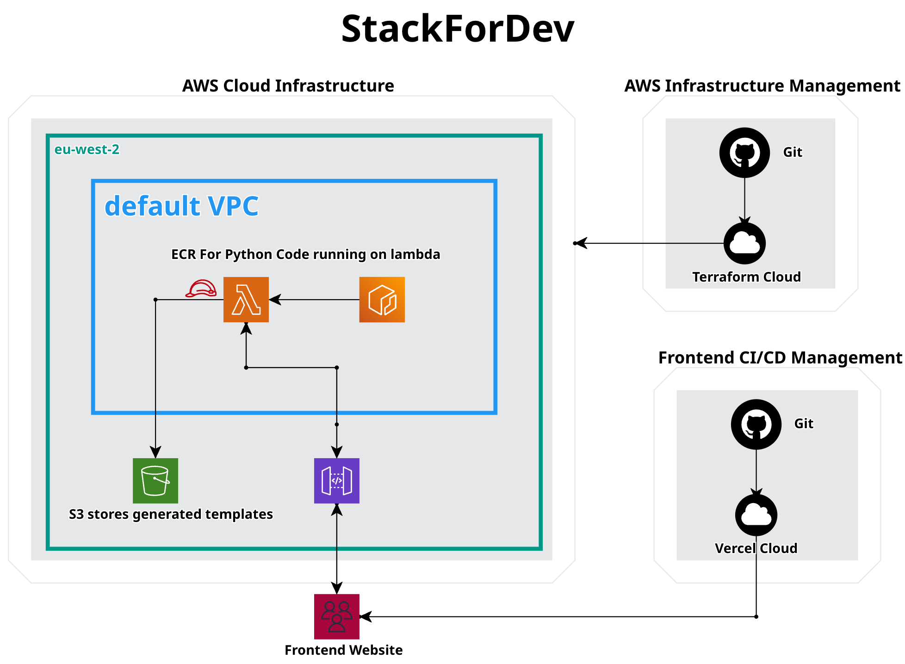

# StackForDev

A service that generates optimized Dockerfiles based on project requirements.

## Architecture



- AWS Lambda (Container Runtime)
- Amazon API Gateway
- Amazon ECR
- Amazon S3
- Terraform Cloud

## Prerequisites

- AWS Account
- Terraform Cloud Account
- Docker installed locally
- Python 3.11+
- Poetry for Python dependency management

## Local Development

1. Install dependencies:
```bash
poetry install
```

2. Set up environment variables:
```bash
export AWS_ACCESS_KEY_ID="your_access_key"
export AWS_SECRET_ACCESS_KEY="your_secret_key"
export AWS_REGION="your_region"
export AWS_ACCOUNT_ID="your_account_id"
```

3. Initialize Terraform:
```bash
cd aws_resources
terraform init
```

## Deployment

The project uses Terraform Cloud for infrastructure management. Deployments are automated through GitHub integration.

If you want to deploy through the Terraform Cloud UI, you can do so by following these steps:

1. Create a new workspace in Terraform Cloud
2. Add the GitHub repository to the workspace
3. Create a new variable set in the workspace and add the AWS credentials as variables
4. Run the plan and apply buttons in the Terraform Cloud UI

### Manual Deployment Steps

1. Push changes to GitHub
2. Terraform Cloud automatically plans and applies changes
3. New Docker image is built and pushed to ECR
4. Lambda function is updated with the latest image

## API Usage

### Generate Dockerfile
```bash
curl -X POST https://api.example.com/prod/generate-dockerfile \
  -H "x-api-key: your_api_key" \
  -H "Content-Type: application/json" \
  -d '{
    "config": {
        "language": "python",
        "dependency_stack": "Django",
        "extra_dependencies": ["pandas", "numpy"],
        "language_version": "3.11"
    }
}'
```

## Project Structure

```
├── aws_resources/          # Terraform infrastructure code
├── docker_templates/       # Dockerfile templates
├── generate_dockerfile.py  # Main Lambda function
├── pyproject.toml         # Python dependencies
└── README.md
```

## Infrastructure

- **API Gateway**: Regional endpoint with API key authentication
- **Lambda**: Container-based function with 30s timeout
- **S3**: Private bucket for Dockerfile storage
- **ECR**: Container registry for Lambda images
- **IAM**: Least-privilege access policies

## Contributing

1. Fork the repository
2. Create a feature branch
3. Commit your changes
4. Push to the branch
5. Create a Pull Request

## License

This project is licensed under the MIT License - see the [LICENSE](LICENSE) file for details.

## Security

- S3 bucket with public access blocked
- IAM role-based access control
- API Gateway with usage plans and API keys
- ECR repository with specific permissions